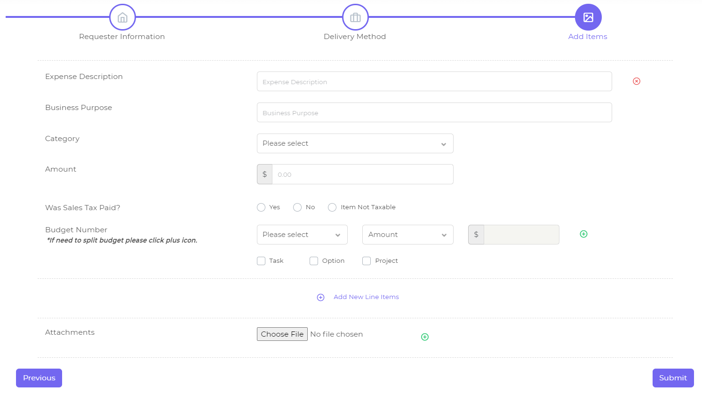

# Administrative and Financial Web Portal

This is a web application built for University of Washington College of Engineering to manage their daily transaction duties. Here is where our website deployed on: https://engine.ce.uw.edu and https://engine.ce.washington.edu .

## Technologies

### Front-end

For front-end, we use [Vuexy HTML Admin Template](https://pixinvent.com/demo/vuexy-html-bootstrap-admin-template/documentation) which is built based on [Bootstrap4](https://getbootstrap.com/) as a framework.

### Back-end

The only task of our back-end work is to provide API for front-end pages. We use [Node.js](https://nodejs.org/en/) and two important [npm](https://www.npmjs.com/) libraries [Express](http://expressjs.com/) and [Mongoose](https://mongoosejs.com/) . Express is a great web framework and it's helpful for routing design. And since we build our database with [MongoDB](https://www.mongodb.com/), so that we use Mongoose to manage and control the data.

## Access Levels

In general we have four access levels. The functions of each access level are shown as below. Before that we have two attributes to claim.

* **Unit**. Defined based on different departments. For example, Electrical and Computer Engineering (ECE) department is a unit, Chemical Engineering (CE) is another unit. Both **Fiscal Staff** and **Administrator** are defined in a scope of unit.

* **Subunit**. Defined based on different laboratories. For example, Network Security Lab is a subunit under ECE unit. Both **Submitter** and **Approver** are defined in a scope of subunit.

*Notice: Although in the above example we say "Network Security Lab is a subunit under ECE unit", we don't have any actual affiliations between subunit and unit in our code. For Fiscal Staff and Administrator, we only have the attribute "Unit". Likewise, for Submitter and Approver, we only have the attribute "Subunit".*

| Access Level  | What They Can Do                                             |
| ------------- | ------------------------------------------------------------ |
| Submitter     | The most basic level, users with this level can submit and track their own requests. |
| Approver      | Approvers are users who have the right to approve (or send back) certain budget numbers of requests under his/her own subunit. Notice that we assign approvers by budget numbers, not just the requests, which means for a request, there might be different approvers if this request contains several budget numbers, one budget number may need approvals from several approvers, one approver may be able to approve several budget numbers. Only all approvers approved a certain budget number, it will be considered approved, and only all budget numbers of this request are approved, this request is considered approved. |
| Fiscal Staff  | Users in this access level can see all requests under his/her unit, and after a request is approved they can take it, then they're able to accept it (which means this request is claimed, but not completed yet) and then mark this request as completed. |
| Administrator | This is the highest level currently, users in this level can do some unit-level settings, like authorizing new users, assigning budget numbers to approvers. |

*Notice: Approvers will be assigned automatically when a request submit, based on Administrator's settings, and they can only see the requests that assigned to them. Fiscal Staffs can see all requests under their own unit, and they can take/untake/reassign a request if that's available, which means the assignment of Fiscal Staff is controlled by users themselves.*

## Request Features

Requests are definitely the most important element of our system. Basically we have six types of requests in total, four general types: reimbursement, purchase request, procard receipt, pay an invoice and two types related to travel: travel request and travel reimbursement. 

### Lifecycle

A typical lifecycle for a request (which means there's no send back or untake or reassign these "accidental" operations) is like this:

```
submitted -> approved -> taken by a certain fiscal staff -> accepted -> completed
```

But during this process, there might be other actions which may lead the request go back to a previous status. So here we listed all possible actions tied to a request below.

| Pre-Status        | Action                   | Post-Status                   | Operator     | Notes                                                        |
| ----------------- | ------------------------ | ----------------------------- | ------------ | ------------------------------------------------------------ |
| *Not Applicable*  | Submit                   | Awaiting Approval             | Submitter    | Marks the beginning of the lifecycle for a request.          |
| Awaiting Update   | Update                   | Awaiting Approval or Approved | Submitter    | When the status is Awaiting Update, that means this request is sent back by Approver or Fiscal Staff, so submitter have to modify some contents and submit it again. |
| Awaiting Approval | Approve                  | Approved                      | Approver     | Only when the status is Awaiting Approval, approvers have the right to approve or send back this request. |
| Awaiting Approval | Send Back                | Awaiting Update               | Approver     | If the request is sent back by Approver, the lifecycle of this request will be restart after update. |
| Approved          | Take / Untake / Reassign | *Status will not be changed*  | Fiscal Staff | Only when the status change to Approved, Fiscal Staff have the right to take this request. If this request is not taken by others, they can take it. Then they can untake it or reassign it to others. |
| Approved          | Accept                   | Accepted                      | Fiscal Staff | Only when Fiscal Staff "take" this request, he/she has the right to accept or send back this request. |
| Approved          | Send Back                | Awaiting Update               | Fiscal Staff | If Fiscal Staff want to send back this request, the status will change to Awaiting Update. |
| Accepted          | Complete                 | Completed                     | Fiscal Staff | Only when a request "accept" by Fiscal Staff, they have the right to "complete" it. This marks the end of the lifecycle for a request. |

*Notice: Why are there two possible post-status when a request is updated by submitter? That because when a Fiscal Staff send back a request, there are two options for them: Bypass Approvers or Require Re-approval. If they pick the former one, that means this request won't need the approval again, so the request status will become Approved directly after update. And if they pick the latter one, that means the lifecycle of this request need to be restart, so that the request status will become Awaiting Approval.*

### Line Item

For the four general request types, we use [jQuery Steps](http://www.jquery-steps.com/) to make sure them look like in the same format. Some of them are different with each other in step 1 and step 2, but all of them have nearly the same content in step 3, which we called as *Line Item*. Within a request users can create any numbers of line item, so that we have *Add New Line Items* button below the line item block. Also we have a delete button at the most right of the first line of each line item block, so that users can delete the whole block if they'd like to. For attachments we put it at the very last line, and we also allows users to upload multiple documents. 



An important element within a line item is the **budget number**. Users can split budget by amount or percentage. For example, the total amount is $100, and you want to reimburse $50 on budget number 910-88, and reimburse another $50 on budget number 920-88. The split value input box for the last budget number will always be disabled, it will calculate automatically by the total amount and previous split value users type in, to make sure the budget number split in a correct way.

Also we use [jQuery Validation](https://jqueryvalidation.org/) to create the validation rule for each request.

## How to use

Unfortunately, only authorized users can login this system. When goes to either above website, it will redirect users to UW SSO system, you need to sign in with your UW NetID. Then the website will jump to the *chooseRole* page, which will show all access levels available to you, then click the corresponding card you want to login as, so that you can enter one of below roles.

### Submitter

The key feature for Submitter level is to submit requests. We have six types of requests that can be submitted, including reimbursement, purchase request, procard receipt, pay an invoice, travel request and travel reimbursement. You can create any type of request under *Create Request* tab. 

For reimbursement, purchase request, procard receipt and pay an invoice, there are 3 steps to finish the request. First 2 steps are self-explaining, but the last one is a little bit tricky, there are several attributes that need to be explained:

* It's acceptable that you can add one or more line items in one request, so that we have *Add New Line Item* button at the end of line item block, and a delete button in the upper right corner of each line item block.
* It's allowed to split budget number in each line item, which means you can pay this line item with multi budget numbers and for each budget number you need to specify that how much you want it to be taken, and we provide two options to split with: amount and percentage. The split value of the last budget number is always disabled (if you don't split, then the single input will be disabled), the disabled one will be calculated automatically based on other values you input. The reason behind this is that we need to make sure the sum of all split value should be valid, which means if you split with amount, the sum of all split values should be equal to the total amount you input in the *Amount* item, if you split with percentage, the sum of all split values should be equal to 100.
* All attachments should be uploaded in the *Attachments* area. Click the plus icon if you need to upload more files.
* Under current setting, it will submit the request directly without overview or prompts when click *submit*, so please consider carefully before submitting.

After submission, the website will jump to the detail page of this request, also you can track all of your requests in *My Requests* tab, and visit detail page by clicking the corresponding request. 

In the request detail page, you will see history of all actions and notes left by approvers or fiscal staff that tied to this request, and also there is an approval board so that you can see who is responsible for approval of this request and what's the decision.

### Approver

Approvers are responsible for request approval, more precisely, for budget number approval. Under either *Dashboard* or *Pending Request* tab you can see all requests that need to be approved by you. By clicking the corresponding row, you can go into the detail page of a certain request. At the bottom there is an Approval Board so that you can make your decision on budget numbers assigned to you, also you can see status of other budget numbers.

### Fiscal Staff

Fiscal Staff can see all requests in their own units in the *General Requests* table. When you take an available request (requests that approved by approvers) the corresponding request will be added into *My Pending Request* section. Additionally you can click on the *List* or *Card* button aside to change the style between list or card.

After taking a request, you can also *untake* it. There will be a dialog to indicate that you can *reassign* this request to someone else or just push it back to the request queue.

Only when you take a request, you have the authority to *Accept* or *Send Back* this request. And when you click *Send Back* button, you will have two options, one is *Required Approval*, which means this request need to approval again (just like restart the request life cycle) after update by submitter. The other one is *Bypass Approvers*, which means this request don't need to be approved again, so after updating you can make next decision to them directly. Finally mark this request as *Completed* when there there is no other things to do.

Notice: When you take a request, this request will be always yours, even when you send it back, you don't have to take it again. Of course, you can untake it or reassign to others at any time.

### Administrator

Administrators are typically control high-level settings. You can add new users in your unit or subunit, and also you can add new budget numbers for a certain subunit.

* My Unit. Under this tab you can *Add* new Administrator or Fiscal Staff to your unit. Also you can *Update* or *Remove* the user that you chose.
* Subunits. This tab is used for setting subunits under your unit. You can add a new subunit in the Subunit Overview section. To add a new submitter, you need to pick a subunit in the Subunit Overview section firstly, and then *add* a new submitter in the Submitter Overview section on the right hand. Also you can *update* or *remove* the information of a certain submitter. Then in the Budget Overview section you can see all budget numbers under this subunit, and for each budget number, you can add/update/remove approvers in the Approvers Overview section.
* All Budgets. Under this tab you can see all budget numbers and edit them if needed.

Notice: Under current settings, it's not able to authorize a user as Approver and Submitter together, or authorize as Administrator and Fiscal Staff together.

### Common Features

* In request detail page, all users can take a note anytime. All notes that tied to this request will be displayed in the Notes section.
* Under User Settings tab, you can edit your profile (user setting page for submitter is not functional yet).

## Features need to be enhanced

* Notification system is not finished.
* Under current settings, it's not able to make a user both Approver and Submitter, or both Fiscal Staff and Administrator. 
* For request update function (when the request is sent back by approvers or fiscal staff), since we use the same `.html` file with create-a-new-request action, we just distinguish these two cases by detecting if there is a `RequestID` item in `systemStorage` variable, which may cause problems when users just want to create a new request while there is such a `RequestID` stored in `sessionStorage`.
* Still for update function, the attachments update and budget number update is not working correctly.
* For Purchase Request and Procard Receipt, the *Save as Default Address* in first step is actually implemented through `localStorage` , not tied to database yet.

## Web Deployment

Currently we put our websites on UW Server, whose environment is Apache + Linux. The `index.php` is the entry file, so make sure put it under `/var/www/html` folder directly, and then put this whole github repo under `/var/www/html` folder as well, which means just replace the existing `index.php` file and `UW-Capstone-Web-Portal` folder with the new one when there is any update.